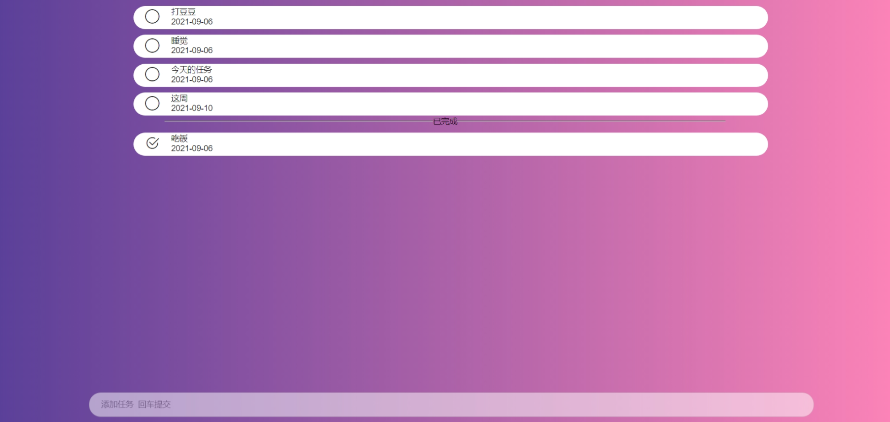
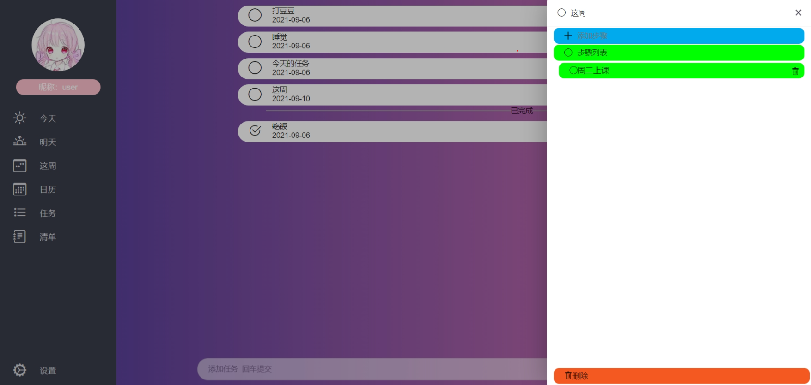
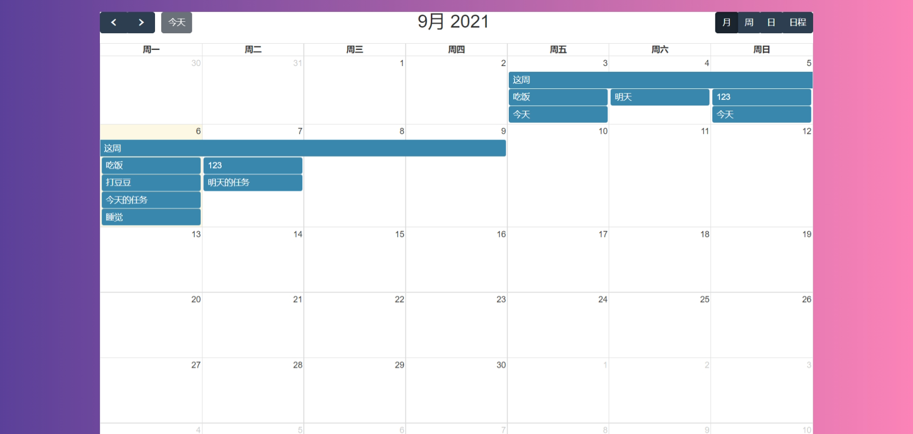

# DoIt

## 系统简介

    一个简单的日程管理系统，

## 技术选型

### 1、系统环境

Java EE 8 Servlet 3.0 Apache Maven 3

### 2、主框架

Spring Boot 2.2.x   
Spring Framework 5.2.x  
Apache Shiro 1.7

### 3、持久层

Apache MyBatis 3.5.x    
MySQL

### 4、视图层

Bootstrap 3.3.7     
Thymeleaf 3.0.x

## 主要功能

1.今天: 展示用户今天的任务,可以添加一些子任务   
2.明天: 为用户规划明天的任务   
3.这周: 用户可以规划这周的任务及其子任务   
4.任务: 展示所有的任务   
5.日历: 在日历视图中显示任务

## 在线体验

演示地址: http://doit.shuaiblog.com

## 演示图

